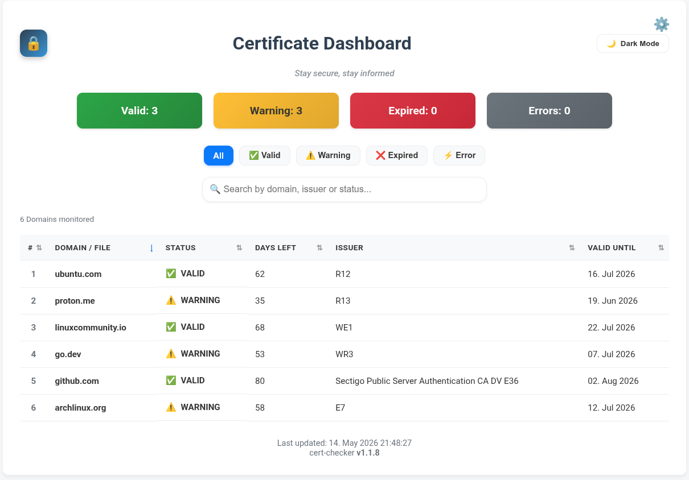
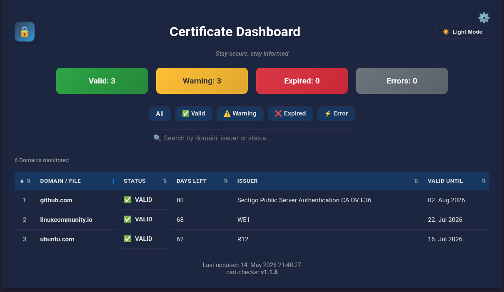

# *Stay secure, stay informed*
       

**Cert-Checker** is a *privacy-focused* [Go](https://go.dev/) tool that monitors **SSL/TLS certificates** on domains and local files, analyzes expiration dates, and alerts users if any issues are detected.
It offers both a powerful **command-line** interface for automation and an interactive **web dashboard**.

## Features
- **Certificate Verification**
   - Hybrid Scanning: Supports remote domains (https://example.com) and local certificate files (.pem, .crt, .key).
   - Chain Validation: Verifies certificate chains, detects self-signed certificates, and identifies missing intermediates.
   - CI/CD Ready: Returns specific exit codes (0=OK, 1=Warning, 2=Error) for integration into pipelines.

- **Interactive Web Dashboard**
   - Real-Time Visualization: Responsive UI with Dark Mode support.
   - Filtering: Filter by status, search by domain/issuer, and sort by expiration date.
   - Auto-Refresh: Configurable background updates (e.g., every 15 mins) to keep data fresh.

- **Security & Privacy**
   - Local Storage: No external databases or cloud dependencies required.
   - HTTPS Dashboard: Built-in support for self-signed or Let's Encrypt certificates to secure the dashboard connection.

- **Automation & Management**
   - Cron Job Manager: Built-in interactive CLI to create, list, and remove scheduled scans.
   - Reporting: Exports detailed JSON reports with timestamps for archival or external processing.

## Quick Start
### Build from source
```bash
git clone https://github.com/mrtoadie/go-check-cert.git
cd go-check-cert
go build -o cert-checker
```
### Run directly (without build)
```bash
go run .
```
### Arch Linux
Install from [AUR](https://aur.archlinux.org/packages/cert-checker)
```bash
yay -S cert-checker
```
### Launch with Dashboard
```bash
# Without HTTPS
./cert-checker -web

# With HTTPS and self-signed certificate
./cert-checker -web -cert ./certs/cert.pem -key ./certs/key.pem
```
Open http://localhost:8080 or https://localhost:8080 in your browser.
## Screenshots




## Command Line Options

| Flag | Description |
| --- | --- |
| -f,	-file	| Path to a local .pem, .crt, .cer, or .key file |
| -c,	-cron |	Interactive Cron setup |
| -ls, -list |	List and manage Cron jobs |
| -l, -log | Show cron job log file |
| -ci,	-ci-mode | CI/CD Mode (non-interactive, uses urls.txt) |
| -w, -web | Start web dashboard on localhost:8080 |
| -cert | Path to SSL certificate file (.pem/.crt) |
| -key |  Path to SSL private key file (.pem) |
| -h,	-help |	Display help message |

## Examples
Check a single certificate:
```bash
./cert-checker -f ./server.crt
```

Set up cron job(s):
```bash
./cert-checker -c
```
List active Cron jobs:
```bash
./cert-checker -ls
```
## Configuration
The tool automatically creates a configuration file on the first run.

Location: `~/.config/cert-checker/urls.txt`

Format: One URL per line. Comments starting with # are supported.

## Output Examples
Text Output (Default)
```bash
=== RESULTS ===

1. forum.linuxguides.de
   Days:  44 | Valid: 26.02.26 → 27.05.26
   Issuer: R12
------------------------------------
2. github.com
   Days:  52 | Valid: 06.03.26 → 03.06.26
   Issuer: Sectigo Public Server Authentication CA DV E36
------------------------------------
=== SUMMARY ===
OK: 0 | Warn: 2 | Exp: 0 | Err: 0
```

JSON Output 
```json
{
  "generated_at": "2026-05-03T14:47:42Z",
  "total_count": 1,
  "results": [
    {
      "url": "https://github.com",
      "status": "OK",
      "days_remaining": 180,
      "is_chain_complete": true,
      "key_algorithm": "RSA",
      "key_size": 2048
    }
  ]
}
```

## Cron Job Management
Interactive Menu

```bash
./cert-checker -cron
```

Options:

1. Set up cron job – Create a new automated check
2. List & manage jobs – View/delete existing jobs
3. Exit – Quit the program

List Cron Jobs

```bash
./cert-checker -list
``

Output:
```bash
=== CERTIFICATE CHECK CRON JOBS ===

1. # cert-checker - 2026-05-03 14:47:42
   0 8 * * * /home/user/cert-checker -ci >> /tmp/cert-check.log 2>&1

2. # cert-checker - 2026-05-03 15:00:00
   0 */6 * * * /home/user/cert-checker -ci >> /tmp/cert-check.log 2>&1

Total: 2 job(s) found.
```

#### Delete Individual Jobs
- Run ./cert-checker -list
- Select "Delete individual jobs"
- Mark jobs with Spacebar
- Confirm with Enter

## Usage
The input is interactive and automatically detects the correct format.

- Press **Enter** to use the default list of URLs (~/.config/cert-checker/urls.txt)

- To check individual URLs: *github.com* or *github.com*, *ubuntu.com*, *example.org*

- Check local certificate file: '~/github.pem'

- Certificate files can also be checked using a flag: cert-checker --file ~/github.pem

Certificate files with the following extensions work: .pem, .cer, .crt, .key

## Tested on
:white_check_mark: [Arch Linux](https://archlinux.org/)

:white_check_mark: [Solus](https://getsol.us/)

:white_check_mark: WSL2 (Ubuntu)

## License
go-check-cert is licensed under the [MIT License](LICENSE).
